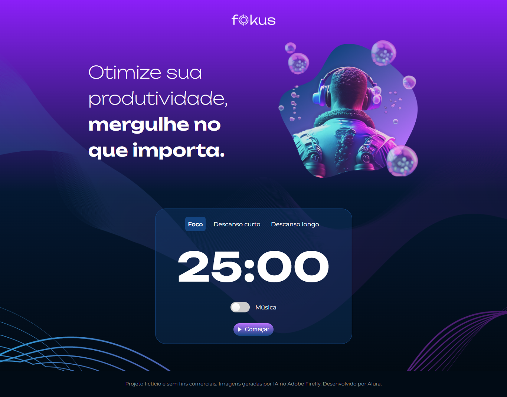

## Fokus

Projeto de gerenciamento de tempo para tarefas que utiliza a técnica Pomodoro.

#

 Esse projeto foi desenvolvido durante a formação Front-end da Oracle + ALura. O foco principal foi aplicar o timer, permitir que uma música seja tocada e alterar a imagem que é exibida de acordo com o tempo escolhido. As funcionalidades foram desenvolvidas em _JavaScript_. 